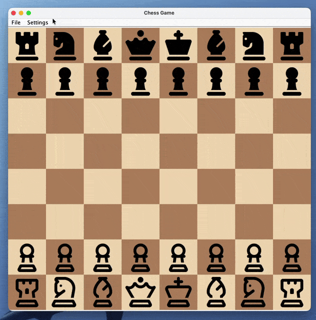
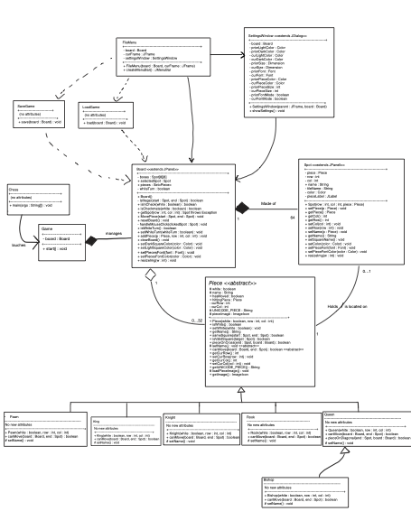

# GUI Chess Game Project

## Team Information
- **Team Name**: Solo Dolo
- **Team Members**: 
  - Miguel Alvarez PQG5
- **Semester**: Fall 2025
- **Course Number and Section**: CS3354 - Section R01

---

## Project Overview
This project is a GUI-based Chess game developed as part of our Object-Oriented Programming course. It combines backend logic from our console-based Phase 1 implementation with a graphical interface built in Phase 2, creating a complete chess game experience with full gameplay functionality.

---

## Preview
### GUI Preview
Regular Move:


Checkmate:




### Class Diagram

Or [ClickHere](Chess/media/Ul.pdf)
---

## How to Run the Project
Follow these instructions to compile and run the project:

1. **Clone the Repository**:  
   ```bash
   git clone https://github.com/formalmiguel/Chess.git
   cd Chess/Chess/src/main/java/
   ```

2. **Compile the Code**:  
   ```bash
   javac -d bin chess_part2/*.java
   ```

3. **Run the Game**:  
   ```bash
   java -cp bin chess_part2.Chess
   ```

---

## Features Checklist
- [✅] GUI with an 8x8 Chessboard
- [✅] Piece Movement with Mouse Interaction
- [✅] Move Validation Based on Chess Rules
- [✅] Capture Mechanism
- [✅] Check and Checkmate Detection
- [✅] Turn-Based Play for Two Players
- [✅] Game End Notification on Checkmate
- [✅] Save and Load Game
- [✅] Change Board Display
- [✅] Change Pieces Display

---
